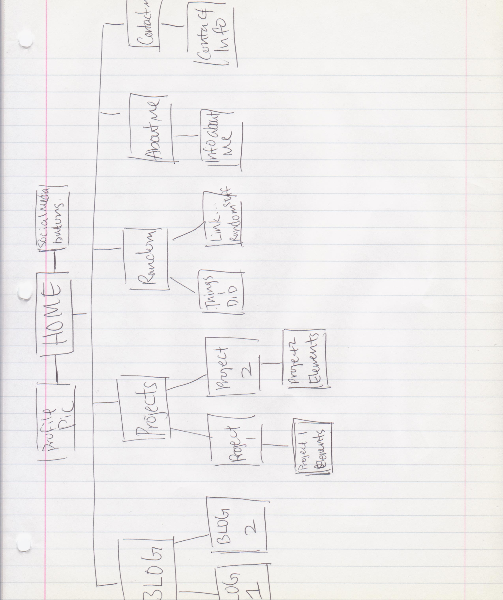

What are the 6 Phases of Web Design?
1.Information Gathering - Find out who will be your readers, the purpose of the site, and what's the goal.
2.Planning - Draw out you site map.
3.Design - Make your site pretty~ depending on what kind of readers you want. 
4.Development - Type out the elements and make a prototype. 
5.Testing and Delivery - Test after development is done. Make sure the site is running properly and smoothly. Now, it's ready to be use.
6.Maintenance - Update you site and keep it fresh for you audience. 

What is your site's primary goal or purpose? What kind of content will your site feature?
My site's primary goal is to record my coding life from beginning to the end. It will have all the projects I finalized to showed others my progress. Blogging for myself and my audience. It will be like my journal of my life as coder from beginning to the end. I would also like to have something about me that's not related to coding so others can know me better. I guess I can even use it as a portfolio to find job if professional enough. 

What is your target audience's interests and how do you see your site addressing them?
My targeted audience will be mainly developers because my site is also mainly revolves around coding. I want to share my experience and knowledge. Also to allow those who wants to be a developer to have a glimpse of how life would be like. 

What is the primary "action" the user should take when coming to your site? Do you want them to search for information, contact you, or see your portfolio? It's ok to have several actions at once, or different actions for different kinds of visitors.
Looking at my portfolio, contact me for collaboration if possible so I can learn from others, and leaving comments. I really hope I will successfully create a comment box for others to leave their opinions about my blogs and projects. 

What are the main things someone should know about design and user experience?
I will say pleasant and efficient. Your site's design should be pleasant to your targeted users and it should be working efficiently for the users. 

What is user experience design and why is it valuable?
From my understand, user experience design is to satisfy your target user as much as possible. You want to know what works and don't works for them, what they like and don't like, and is the site providing what they need. This will help a site to make their user stay and attrach more to use it. Another thing is, unless the site's purpose and goal is solely for yourself, you have to understand who your users are and what they want. If there's no users, then there's really no point of having an "empty" site. 

Which parts of the challenge did you find tedious?
For me,  displaying my site-map inline in this file. I think I'm either the only or very few of the students using Cloud9 instead Git. I literally spend more than an hour, frustrated, trying to display the image. I'm pretty sure it's not even in the right direction right now. For some strange reason, Cloud9 have problem showing the image when I previews it. It kept showing that "broken-image" icon. Long story short, Cloud9 was just being weird and got me confused that I must've done something wrong when I hadn't. Images just won't show on a md file on Cloud9...