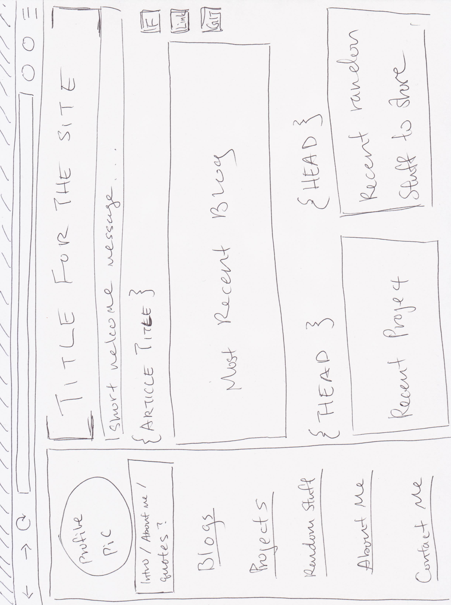
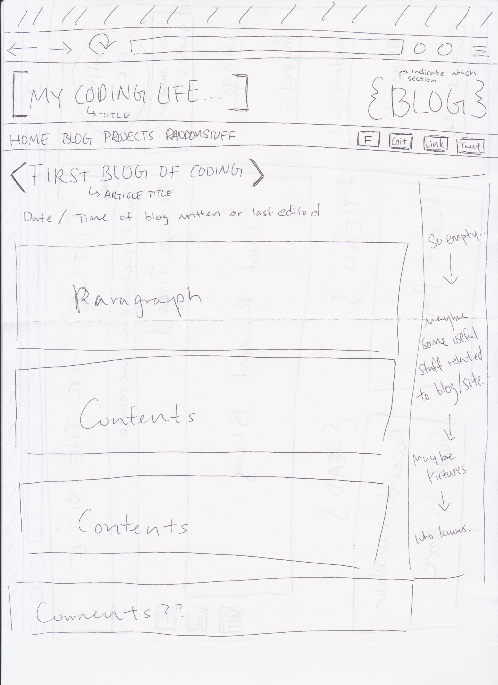

What is a wireframe?
Wireframe is bascially a blueprint of how your site would look like. It's usually just a simple layout.

What are the benefits of wireframing?
I think that one of the benefits will be decreasing the time of making changes. Since you already have wireframe infront of you, it's much easier to create a skeleton for you site. There will be more changes happening if there's no wireframe because you don't know how it look like until you save and preview what you have so far.

Did you enjoy wireframing your site?
Yes, I did. It was quick to draw out an idea of the layout of my site and it was fun to make a goal for myself. The wireframe makes me excited to have my site created.

Did you revise your wireframe or stick with your first idea?
I revised maybe two times and I'm sure I will revise it again as I learn more about HTML and CSS. 

What questions did you ask during this challenge? What resources did you find to help you answer them?
I didn't have any questions for this challenge because it was pretty straight forward of what I need to do. The articles provided for this challenge was helpful enough for me.

Which parts of the challenge did you enjoy and which parts did you find tedious?
I enjoy drawing out my wireframe and taking that first step to make my site into reality! I didn't find any part of this challenge tedious at all. It was pretty easy and fun.