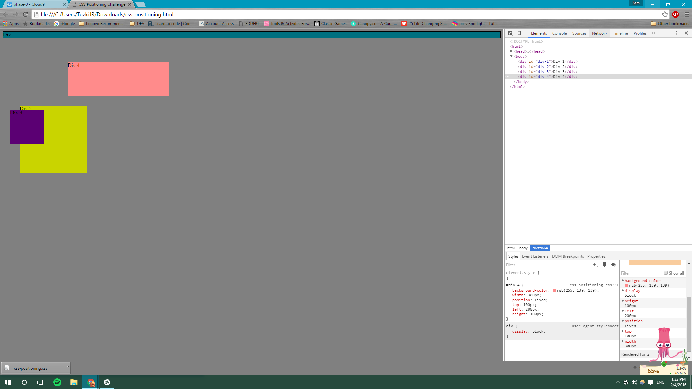
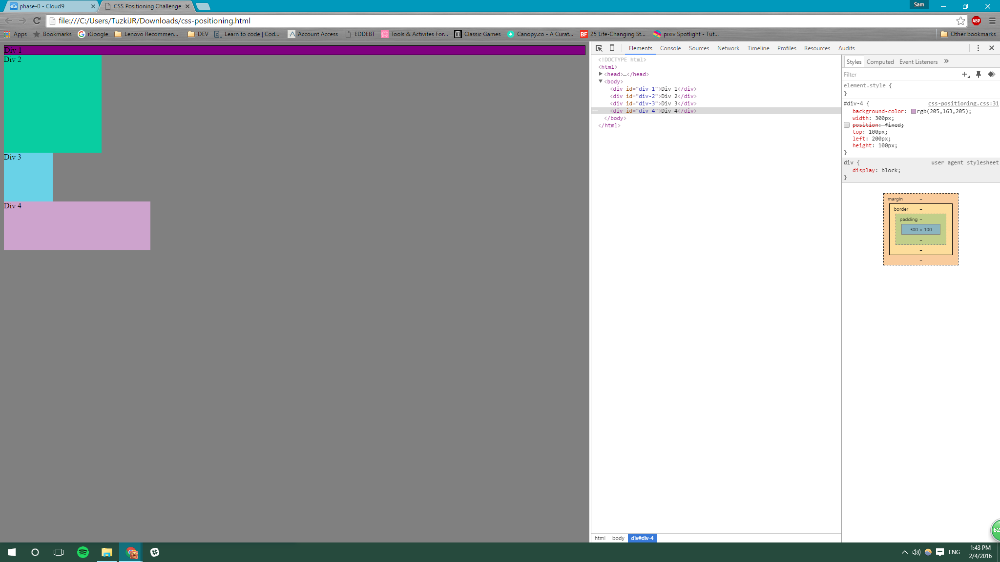
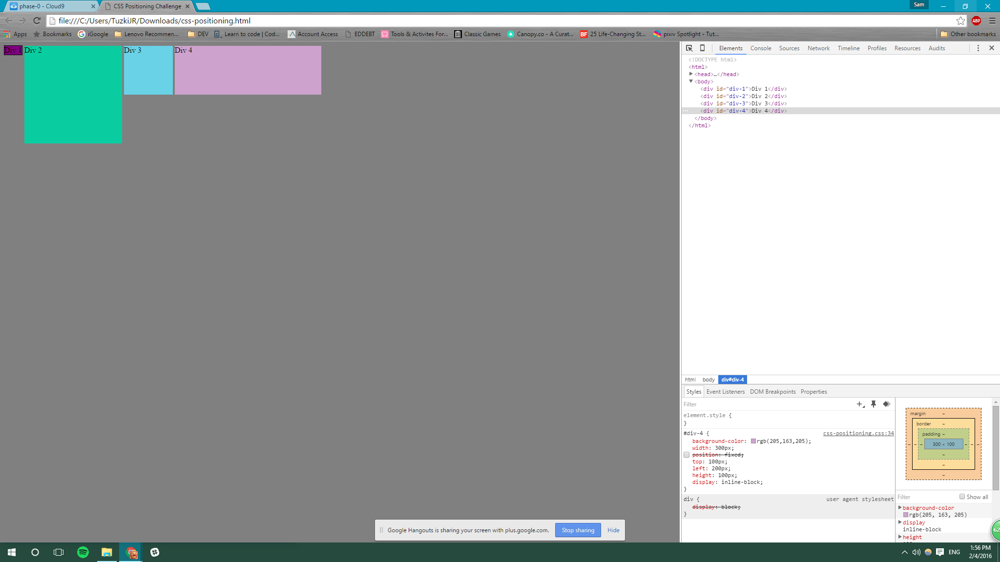
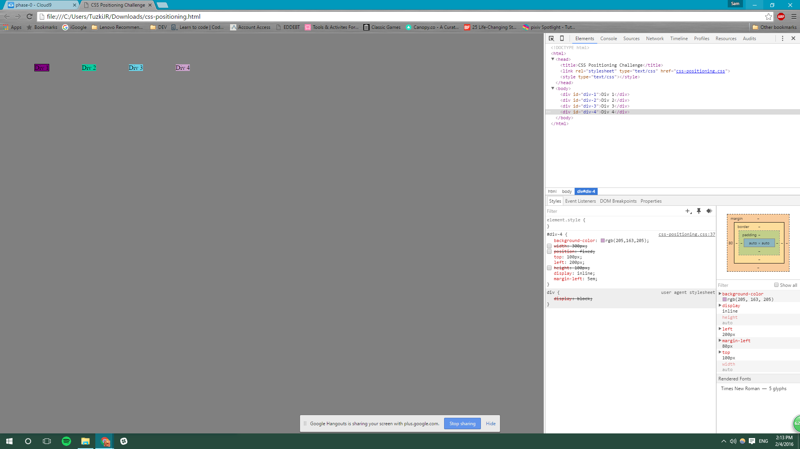
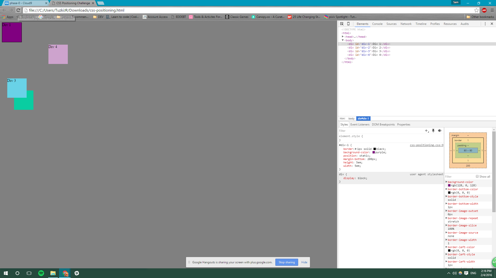
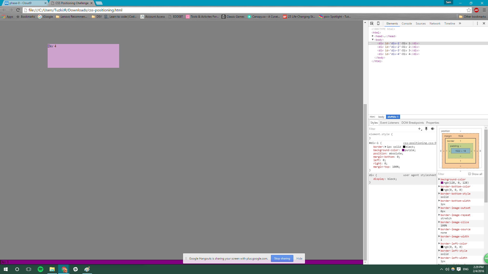
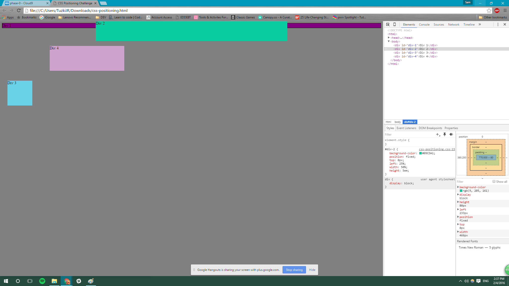
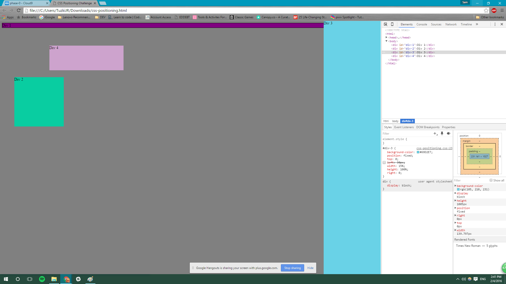
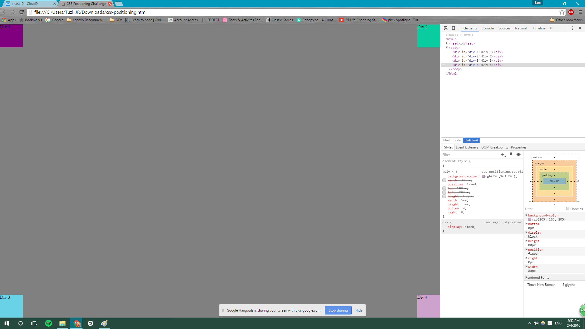

####How can you use Chrome's DevTools inspector to help you format or position elements?

####How can you resize elements on the DOM using CSS?

####What are the differences between absolute, fixed, static, and relative positioning? Which did you find easiest to use? Which was most difficult?

####What are the differences between margin, border, and padding?

####What was your impression of this challenge overall? (love, hate, and why?)