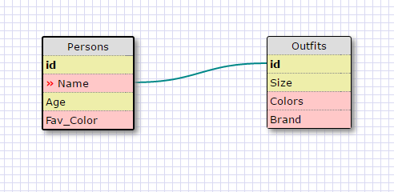

Release 5:
1. select * from state;
2. select * from region;
3. select state_name, population from states;
4. select state_name, population from states order by population desc;
5. select state_name from states where region_id=7;
6. select state_name, population_density from states where population_density > 50 order by population_density ASC;
7. select state_name from states where population > 1000000 and population < 1500000;
8. select state_name, region_id from states order by region_id ASC;
9. select region_name from regions where region_name like '%central';
10. select regions.region_name, states.state_name from regions inner join states on regions.id=states.region_id order by regions.id;

Reflection:
What are databases for?
Databases is for us to store, retrieve, and even manipulate data.

What is a one-to-many relationship?
One-to-many relationship is when a record from one table links to many record from another table.

What is a primary key? What is a foreign key? How can you determine which is which?
Primary key is the unique identifier which identifies each record. Foreign key is the record that links to a primary key. We can determine which is which by looking at the link between the two, if multiple key is linking to one key then that one key is primary because there can only be one primary key in a talbe.

How can you select information out of a SQL database? What are some general guidelines for that?
To select any information from SQL, all we have to do is type in SELECT (data you want) FROM (table containing that data). 
