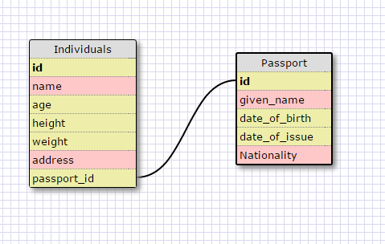
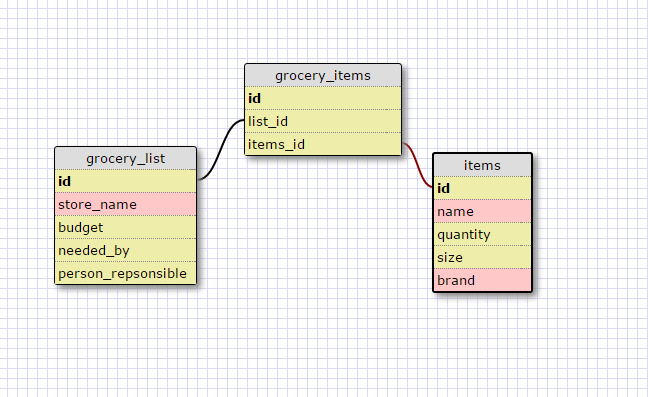

 

 

What is a one-to-one database?
One-to-one database is when two records share a single relationship which means they can only link with each other. 

When would you use a one-to-one database? (Think generally, not in terms of the example you created).
Use one-to-one database when a single relationship exist. Meaning, dataA can only have 1 dataB while dataB can only have 1 dataA.

What is a many-to-many database?
Many-to-many is when two tables share many relationship with each other. 

When would you use a many-to-many database? (Think generally, not in terms of the example you created).
It's best to use when we are dealing with datas that contains several records of each other. An example is a library can have many different books and a book can be found in many libraries.

What is confusing about database schemas? What makes sense?
Overall, I understand database schemas. I felt like as long as we understand what type of data we are handling and what kind of relationship those data have with each other then we can easily identify how the datatbase schemas would be like.